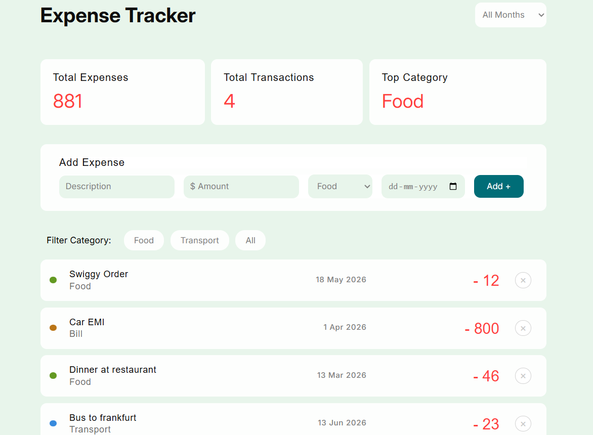

# spendwise

A smart expense tracker that runs entirely in the browser — no backend, no framework, just vanilla JavaScript.

## Live Demo
[View App](https://bitdrifter0x.github.io/spendwise/)

## Features
- Add and delete expenses with category and date
- Filter by category and month
- KPI cards — total spent, transactions, top category
- Data persists across sessions via localStorage

## Built With
HTML · CSS · Vanilla JavaScript

## What I Learned
DOM manipulation, event handling, array methods (map, filter, reduce), localStorage, and dynamic rendering patterns.

## Screenshot
## Preview

